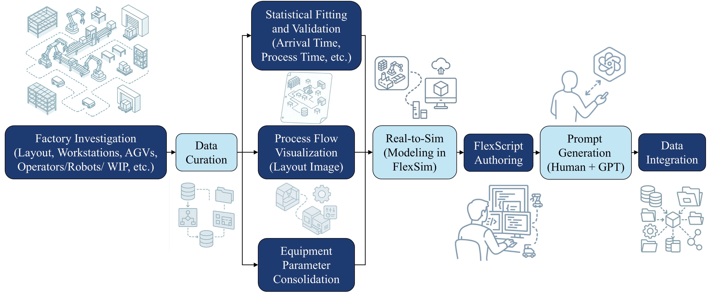
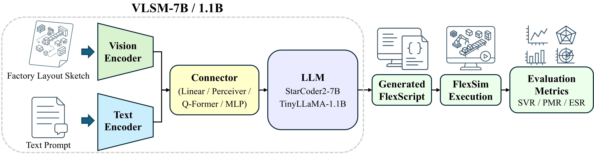

# Generative Digital Twins: Vision-Language Simulation Models for Executable Industrial Systems

> **CVPR 2026 Submission (Anonymous)**  
> Repository for the paper *“Generative Digital Twins: Vision-Language Simulation Models for Executable Industrial Systems.”*  


---

## Overview

<p align="center">
  
</p>

This work introduces **Vision-Language Simulation Models (VLSM)** that unify visual and textual understanding to generate **executable FlexScript** for industrial simulation systems.  
Two model families are trained on the **GDT-120K** dataset:

| Model | Type | Purpose |
|--------|------|----------|
| **StarCoder2-7B (QLoRA fine-tuned)** | 4-bit quantized fine-tune | Lightweight inference with code-specialized backbone |
| **TinyLLaMA-1.1B (fully retrained)** | Full-precision retraining | Compact model for domain specialization |

All configuration and tokenizer files are included for reproducibility.  
Full checkpoints and adapter weights will be released **after the CVPR 2026 review period** to comply with double-blind submission policy.

---

## Dataset Construction

<p align="center">
  
</p>

The **GDT-120K** dataset contains prompt–sketch–code triplets designed for industrial simulation.  
Each sample includes:
- A natural-language description of production logic  
- A layout sketch describing workstation topology  
- Corresponding executable FlexScript code  

Dataset covers **13 industrial categories**, from manual assembly to fully automated AGV systems.  
All parameters (e.g., `InterArrivalTime`, `ProcessTime`, `maxcontent`) follow realistic timing distributions ensuring FlexSim executability.

---

## Architecture Overview

<p align="center">
  
</p>

The **Vision-Language Simulation Model (VLSM)** integrates:
- **Visual Encoder:** CLIP / OpenCLIP (ViT-g/14)
- **Connector:** Linear, perceiver,  Q-Former, or MLP for cross-modal fusion
- **Language Backbone:** TinyLLaMA-1.1B or StarCoder2-7B

Two optimized configurations:
| Model | Vision Encoder | Connector | Backbone |
|--------|----------------|-----------|-----------|
| **VLSM-1.1B** | OpenCLIP | Linear Projection | TinyLLaMA-1.1B |
| **VLSM-7B**   | OpenCLIP | Two-Layer MLP | StarCoder2-7B |

The corresponding training scripts are provided in `Code/LMM/` as `OpenCLIP_Linear_Projection_Tinyllama.py` (VLSM-1.1B) and `OpenCLIP_Two_MLP_StarCoder2.py` (VLSM-7B).

---

## LLM Baselines on FlexScript
We evaluate seven open-source LLM backbones on the GDT-120K text-to-FlexScript task.  
Scores are reported on the held-out test set (best epoch per model).

| Model             | Best SVR | Best PMR | Best ESR | Best BLEU-4 |
|-------------------|---------:|---------:|---------:|------------:|
| Gemma3-270M       | 0.9328   | 0.9219   | 0.8040   | 0.9318      |
| TinyLLaMA-1.1B    | 0.9444   | 0.9424   | 0.8380   | 0.9467      |
| Mistral-7B        | 0.9107   | 0.6108   | 0.6860   | 0.6925      |
| LLaMA2-7B         | 0.7104   | 0.0513   | 0.4480   | 0.3660      |
| CodeLLaMA-7B      | 0.5127   | 0.1654   | 0.4660   | 0.3874      |
| **StarCoder2-7B** | **0.9905** | **0.9886** | **0.8620** | **0.9811** |
| LLaMA3-8B         | 0.2447   | 0.0466   | 0.1920   | 0.1539      |

---

## Multimodal Ablation for VLSM

**TinyLLaMA-1.1B with vision encoders and connector modules (Table 4 in the paper).  
The first row is the text-only baseline.**

| Vision Encoder                 | Connector                  | SVR    | PMR    | ESR    | BLEU-4 |
|--------------------------------|----------------------------|-------:|-------:|-------:|-------:|
| TinyLLaMA-1.1B (LLM-only)      | –                          | 0.9444 | 0.9424 | 0.8380 | 0.9467 |
| CLIP                           | Linear Projection          | 0.8911 | 0.9284 | 0.8020 | 0.9164 |
| CLIP                           | Perceiver-style Resampler  | 0.8607 | 0.9311 | 0.8080 | 0.9205 |
| CLIP                           | Q-Former                   | 0.8535 | 0.9311 | 0.7960 | 0.9150 |
| CLIP                           | Two-Layer MLP              | 0.9059 | 0.9229 | 0.8300 | 0.9238 |
| OpenCLIP                       | Linear Projection          | 0.9408 | 0.9505 | 0.8820 | 0.9482 |
| OpenCLIP                       | Perceiver-style Resampler  | 0.9144 | 0.9330 | 0.8040 | 0.9204 |
| OpenCLIP                       | Q-Former                   | 0.9314 | 0.9422 | 0.8500 | 0.9265 |
| OpenCLIP                       | Two-Layer MLP              | 0.9243 | 0.9403 | 0.8220 | 0.9222 |

**StarCoder2-7B with vision encoders and connector modules (Table 5 in the paper).  
The first row is the text-only baseline.**

| Vision Encoder                 | Connector                  | SVR    | PMR    | ESR    | BLEU-4 |
|--------------------------------|----------------------------|-------:|-------:|-------:|-------:|
| StarCoder2-7B (LLM-only)       | –                          | 0.9905 | 0.9886 | 0.8620 | 0.9811 |
| CLIP                           | Linear Projection          | 0.9958 | 0.9930 | 0.8640 | 0.9874 |
| CLIP                           | Perceiver-style Resampler  | 0.9903 | 0.9928 | 0.8480 | 0.9843 |
| CLIP                           | Q-Former                   | 0.9825 | 0.9876 | 0.8380 | 0.9724 |
| CLIP                           | Two-Layer MLP              | 0.9861 | 0.9932 | 0.8420 | 0.9829 |
| OpenCLIP                       | Linear Projection          | 0.9958 | 0.9857 | 0.8720 | 0.9866 |
| OpenCLIP                       | Perceiver-style Resampler  | 0.9857 | 0.9849 | 0.8600 | 0.9862 |
| OpenCLIP                       | Q-Former                   | 0.9948 | 0.9913 | 0.8660 | 0.9868 |
| **OpenCLIP**                   | **Two-Layer MLP**          | **0.9990** | **0.9922** | **0.8740** | **0.9886** |

---

## Training Scripts
| Script | Location | Description |
|--------|----------|-------------|
| `starcoder2_7b_finetuning.py` | `Code/LLM/` | Fine-tuning StarCoder2-7B using QLoRA (PEFT). Supports 4-bit quantization and adapter training. |
| `tinyllama_fully_retrain.py` | `Code/LLM/` | End-to-end retraining of TinyLLaMA-1.1B on GDT-120K with full precision. |
| `OpenCLIP_Linear_Projection_Tinyllama.py` | `Code/LMM/` | Trains VLSM-1.1B by attaching a linear projection connector on top of OpenCLIP and TinyLLaMA-1.1B. |
| `OpenCLIP_Two_MLP_StarCoder2.py` | `Code/LMM/` | Trains VLSM-7B with a two-layer MLP connector on top of OpenCLIP and StarCoder2-7B. |

Each script expects a standard Hugging Face model interface and can be launched with `torchrun` or `accelerate`.

---

## Configuration Files
All hyperparameters and tokenizer settings are preserved under `configs/`.

| Directory | Description |
|------------|-------------|
| `configs/StarCoder2/` | Adapter configuration, tokenizer, and LoRA metadata. |
| `configs/TinyLlama-1.1b/` | Full retraining setup including scheduler state and generation configuration. |

These files ensure full reproducibility without exposing model weights.

---

## Docker Environments

| Model | Dockerfile | PyTorch / CUDA | Notes |
|---|---|---|---|
| **StarCoder2-7B (QLoRA)** | `dockerfiles/Dockerfile_StarCoder2` | **PyTorch 2.3.0 / CUDA 11.8** | runtime + cuDNN 8 |
| **TinyLLaMA-1.1B (Full retrain)** | `dockerfiles/Dockerfile_TinyLlama` | **PyTorch 2.1.0 / CUDA 11.8** | runtime + cuDNN 8 |

**Build**
```bash
docker build -t gdt-starcoder2 -f dockerfiles/Dockerfile_StarCoder2 .
docker run --gpus all -it --rm gdt-starcoder2
```

---

## Model Weights (to be released after review)
Due to the CVPR 2026 double-blind policy and GitHub size constraints, model checkpoints are temporarily withheld.
After the review process, fine-tuned weights and full retraining checkpoints will be made available via Google Drive.

Planned uploads:

|Model | Files	| Hosting
|--------|-------------|-------|
|StarCoder2-7B (QLoRA fine-tuned, epoch 6 best)	| adapter_model.safetensors, optimizer.pt, trainer_state.json	| Google Drive (to be added)
|TinyLLaMA-1.1B (fully retrained, best checkpoint)	| model.safetensors, optimizer.pt, trainer_state.json	| Google Drive (to be added)

A checkpoints_link.txt file will be added post-review with direct download links.

---

## License
This repository is released under the MIT License (see LICENSE).

---

## Contact
Details will be added following the CVPR 2026 review phase.
